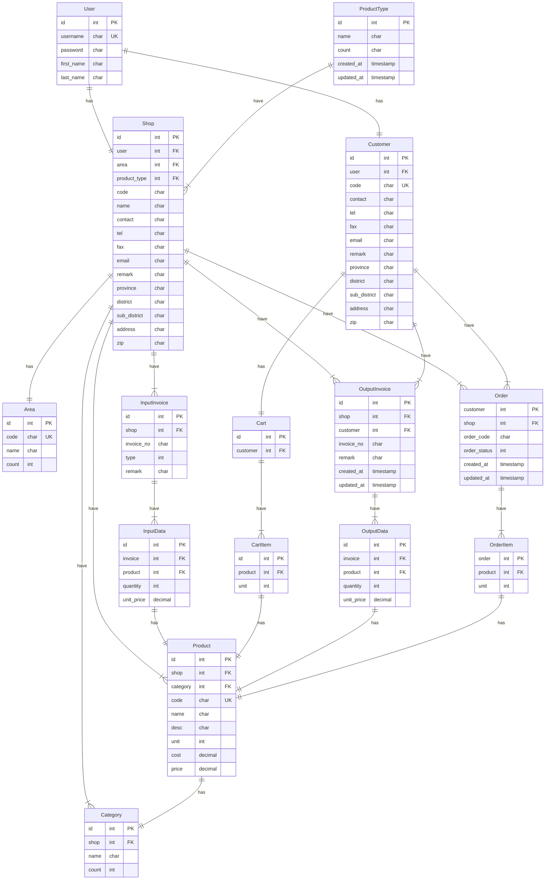

# Marketplace 

 

## Scope of the system
The Marketplace system will allow general users to open a store to sell products or services. The system will act as a central hub for matching buyers and sellers.
## System users
System users are divided into two categories:
Buyers: Those who want to buy products or services.
Sellers: Those who want to sell products or services.
## System features
The Marketplace system has the following features:
- User registration and login
- Shopping cart system
- Product and service ordering
- Order creation and cancellation
- Store creation
- Address editing
- Subscription and store opening for sellers
- Product and service information management
- Product category management
- Price and sales condition setting
- Import and export record viewing
- Order viewing and status management
## Additional details
Developed using Django, Django REST Framework, and Vue.js
Still under development, but partially functional
Code available on GitHub
## Conclusion
The Marketplace system is a platform that connects buyers and sellers, providing features for transactions, order management, and store management. It's still under development, but has the potential to be a valuable resource for both parties.

## Entity Relations Diagram (ERD)

---
## Data Dictionary

### User
| Field | Type  | Domain  |  Key |
|  ---  |  ---  |   ---   |  --- |
| id  | INT | 11 | PK |
| username | CHAR  |  (255) |
| email  | CHAR   | (255)  |
| password  | CHAR  |  (255) |

### ProductType
| Field | Type  | Domain  |  Key |
|  ---  |  ---  |   ---   |  --- |
| id  | INT | 11 | PK |   |
| name | CHAR  |  (255) |  |
| count  | INT  |  (255) |  |

### Area
| Field | Type  | Domain  |  Key |
|  ---  |  ---  |   ---   |  --- |
| id  | INT | 11 | PK |   |
| code | CHAR  |  (255) | UK |
| name | CHAR  |  (255) |  |
| count  | INT  |  (255) |  |

### Shop

| Field | Type  | Domain  |  Key |
|  ---  | ---   |  ---    |  --- |
| id  | INT | 11 | PK |   |
| user | INT  |  (11) |  FK |
| product_type | INT  |  (11) |  FK |
| area  | INT  |  (11) |  FK  |
| name  | CHAR   | (255)  | -    |
| code  | CHAR   | (6)  |  -   |
| contact  | CHAR   | (255)  |  -   |
| tel  | CHAR   | (10)  |  -   |
| fax  | CHAR   | (10)  |  -   |
| email  | CHAR   | (255)  |   -  |
| remark  | TEXT   | ()  | -    |
| address  | TEXT   | ()  | -    |
| province  | CHAR   | (255)  |   -  |
| district  | CHAR   | (255)  |   -  |
| sub_district  | CHAR   | (255)  |  -   |
| zip  | CHAR   | (5)  |   -  |
| created_at  | TIMESTAMP   | ()  |   -  |
| updated_at  | TIMESTAMP   | ()  |   -  |

### ProductCategory
| Field | Type  | Domain  |  Key |
|  ---  |  ---  |   ---   |  --- |
| id  | INT | 11 | PK |   |
| shop | INT  |  (11) | FK |
| name | CHAR  |  (255) | - |
| count  | INT  |  (11) | - |

### Product
| Field | Type  | Domain  |  Key |
|  ---  |  ---  |   ---   |  --- |
| id  | INT | 11 | PK |   |
| shop | INT  |  (11) | FK |
| category | INT  |  (11) | FK |
| code | CHAR  |  (8) | - |
| name | CHAR  |  (255) | - |
| desc | TEXT  |  () | - |
| unit | INT  |  (11) | - |
| price  | DECIMAL   | (9, 2)  | -    |
| cost  | DECIMAL   | (9, 2)  |  -   |
| created_at  | TIMESTAMP   | ()  |   -  |
| updated_at  | TIMESTAMP   | ()  |   -  |

### InputInvoice
| Field | Type  | Domain  |  Key |
|  ---  |  ---  |   ---   |  --- |
| id  | INT | 11 | PK |   |
| shop | INT  |  (11) | FK |
| invoice_no  | INT  |  (16) | - |
| type  | INT  |  (11) | - |
| remark  | TEXT   | ()  |  -   |
| created_at  | TIMESTAMP   | ()  |  -   |
| updated_at  | TIMESTAMP   | ()  |   -  |

### InputData
| Field | Type  | Domain  |  Key |
|  ---  |  ---  |   ---   |  --- |
| id  | INT | 11 | PK |   |
| shop | INT  |  (11) | FK |
| invoice  | INT  |  (11) | FK |
| quantity  | INT   | (11)  |   -  |
| unit_price  | DECIMAL   | (9, 2)  |   -  |
| created_at  | TIMESTAMP   | ()  |   -  |
| updated_at  | TIMESTAMP   | ()  |    - |

### Customer
| Field | Type  | Domain  |  Key |
|  ---  |  ---  |   ---   |  --- |
| id |   INT  |    (11)  |    PK   |
| user |  INT   |   (11)   |   FK    |
| code |   CHAR  |  (16)    |  FK     |
| contact |  CHAR   |  (255)    |    -   |
| tel |   CHAR  |   (10)   |    -   |
| fax |   CHAR  |    (10)  | -      |
| email |   CHAR  |    (255)  |   -    |
| remark |  TEXT   |   ()   |   -    |
| province |  CHAR   |  (255)    |   -    |
| district |   CHAR  |  (255)    |   -    |
| sub_district |   CHAR  |   (255)   |     -  |
| address |   TEXT  |   ()   |     -  |
| zip |  CHAR   |  (5)    |    -  |
| created_at |  TIMESTAMP   |  ()    |   -    |
| updated_at | TIMESTAMP    | ()     |    -   |

### Cart
| Field | Type  | Domain  |  Key |
|  ---  |  ---  |   ---   |  --- |
| id | INT | (11) | PK |
| customer | INT | (11) | FK |

### CartItem
| Field | Type  | Domain  |  Key |
|  ---  |  ---  |   ---   |  --- |
| id | INT | (11) | PK |
| cart | INT | (11)  |  FK  |
| product | INT | (11)  |  FK  |
| unit | INT | (11)  |  -  |

### Order
| Field | Type  | Domain  |  Key |
|  ---  |  ---  |   ---   |  --- |
| id | INT | (11) | PK |
|  customer  |   INT  |   (11)   |  FK    |
|  shop  |  INT   |   (11)   |   FK   |
|  order_code  |  CHAR   |   (9)   |   -   |
|  order_status  | INT    |   (11)   |   -   |
| created_at |  TIMESTAMP   |  ()    |    -   |
| updated_at | TIMESTAMP    | ()     |    -   |

### OrderItem
| Field | Type  | Domain  |  Key |
|  ---  |  ---  |   ---   |  --- |
| id | INT | (11) | PK |
|  order  |  INT  | (11)  |  FK  |
|  product  |  INT  | (11)  |  FK  |
|  unit  |  INT  | (11)  |  -  |

### OutputInvoice
| Field | Type  | Domain  |  Key |
|  ---  |  ---  |   ---   |  --- |
| id | INT | (11) | PK |
|  shop  |   INT  |  (11)   |   FK |
|  customer  |   INT  |  (11)   |  FK  |
|  invoice_no  |   CHAR  |  (16)   |  -  |
|  remark  |   TEXT  |  ()   |  -  |
| created_at |  TIMESTAMP   |  ()    |   -    |
| updated_at | TIMESTAMP    | ()     |   -    |

### OutputData

| Field | Type  | Domain  |  Key |
|  ---  |  ---  |   ---   |  --- |
| id | INT | (11) | PK |
|  invoice  |  INT    | ( 11) |  FK    |
|  product  |   INT   | (11 ) |  FK    |
|  quantity  |    INT  | (11 ) | FK     |
|  unit_price  |  DECIMAL    | (9,2 ) |   -   |
 

## Interface
### หน้าหลัก
