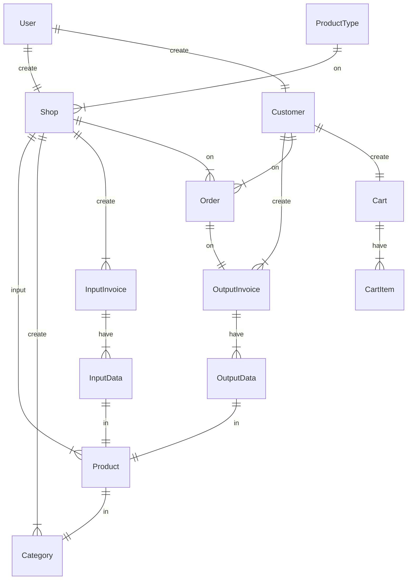

# Marketplace 

 

## ขอบเขตของระบบ 

ระบบ Marketplace นี้จะอนุญาตให้ผู้ใช้ทั่วไปสามารถเปิดร้านขายสินค้าหรือบริการได้ โดยระบบจะทำหน้าที่เป็นศูนย์กลางในการจับคู่ระหว่างผู้ซื้อและผู้ขาย 

## ผู้ใช้งานระบบ 

ผู้ใช้งานระบบแบ่งออกเป็น 2 ประเภท ได้แก่ 

- ผู้ซื้อ : เป็นผู้ที่ต้องการซื้อสินค้าหรือบริการ 

- ผู้ขาย : เป็นผู้ที่ต้องการขายสินค้าหรือบริการ 

## คุณสมบัติของระบบ 

ระบบ Marketplace มีคุณสมบัติดังต่อไปนี้ 

- ผู้ขายสามารถสมัครสมาชิกและเปิดร้านขายสินค้าหรือบริการได้ 

- ผู้ขายสามารถเพิ่มข้อมูลสินค้าหรือบริการลงในร้านของตัวเองได้ 

- ผู้ขายสามารถตั้งราคาและเงื่อนไขการขายสินค้าหรือบริการได้ 

- ผู้ขายสามารถดูบันทึกการนำเข้าสินค้าได้ 

- ผู้ขายสามารถดูคำสั่งซื้อได้ และ เปลี่ยนสถานะคำสั่งซื้อได้ 

- ผู้ซื้อสามารถค้นหาสินค้าหรือบริการที่ต้องการได้ 

- ผู้ซื้อสามารถสั่งซื้อสินค้าหรือบริการจากร้านขายได้ 

- ผู้ซื้อสามารถสร้างคำสั่งซื้อ และ ยกเลิกคำสั่งซื้อได้ 

 

## รายละเอียดคุณสมบัติ 

**ผู้ขาย**

- ผู้ขายสามารถสมัครสมาชิกและเปิดร้านขายสินค้าหรือบริการได้ โดยจะต้องกรอกข้อมูลส่วนบุคคลและข้อมูลร้านขายให้ครบถ้วน 

- ผู้ขายสามารถเพิ่มข้อมูลสินค้าหรือบริการลงในร้านของตัวเองได้ โดยจะต้องกรอกข้อมูลสินค้าหรือบริการให้ครบถ้วน เช่น ชื่อสินค้าหรือบริการ, รายละเอียดสินค้าหรือบริการ, รูปภาพสินค้าหรือบริการ, ราคาสินค้าหรือบริการ, เงื่อนไขการขายสินค้าหรือบริการ เป็นต้น 

- ผู้ขายสามารถตั้งราคาและเงื่อนไขการขายสินค้าหรือบริการได้ โดยจะต้องเป็นไปตามนโยบายของทางระบบ 

**ผู้ซื้อ** 

- ผู้ซื้อสามารถค้นหาสินค้าหรือบริการที่ต้องการได้ โดยสามารถค้นหาจากชื่อสินค้าหรือบริการ, ประเภทสินค้าหรือบริการ, เงื่อนไขการขายสินค้าหรือบริการ เป็นต้น 

- ผู้ซื้อสามารถสั่งซื้อสินค้าหรือบริการจากร้านขายได้ โดยจะต้องกรอกข้อมูลการจัดส่งสินค้าหรือบริการให้ครบถ้วน 

## Entity Relations Diagram (ERD)

