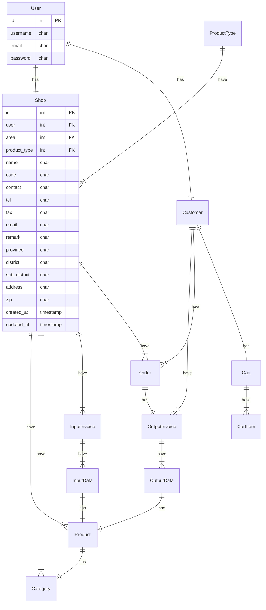

# Marketplace 

 

## ขอบเขตของระบบ 

ระบบ Marketplace นี้จะอนุญาตให้ผู้ใช้ทั่วไปสามารถเปิดร้านขายสินค้าหรือบริการได้ โดยระบบจะทำหน้าที่เป็นศูนย์กลางในการจับคู่ระหว่างผู้ซื้อและผู้ขาย 

## ผู้ใช้งานระบบ 

ผู้ใช้งานระบบแบ่งออกเป็น 2 ประเภท ได้แก่ 

- ผู้ซื้อ : เป็นผู้ที่ต้องการซื้อสินค้าหรือบริการ 

- ผู้ขาย : เป็นผู้ที่ต้องการขายสินค้าหรือบริการ 

## คุณสมบัติของระบบ 

ระบบ Marketplace มีคุณสมบัติดังต่อไปนี้ 

- ผู้ซื้อสามารถสั่งซื้อสินค้าหรือบริการจากร้านขายได้ 

- ผู้ซื้อสามารถสร้างคำสั่งซื้อ และ ยกเลิกคำสั่งซื้อได้ 

- ผู้ซื้อสามารถเปิดร้านขายเป็นของตัวเองได้ 

- ผู้ซื้อสามารถแก้ไขรายละเอียดที่อยู่ตัวเองได้

- ผู้ขายสามารถสมัครสมาชิกและเปิดร้านขายสินค้าหรือบริการได้ 

- ผู้ขายสามารถเพิ่มข้อมูลสินค้าหรือบริการลงในร้านของตัวเองได้ ทีละหลายรายการ

- ผู้ขายสามารถเพิ่มหมวดหมู่สินค้าได้

- ผู้ขายสามารถตั้งราคาและเงื่อนไขการขายสินค้าหรือบริการได้ 

- ผู้ขายสามารถดูบันทึกการนำเข้าสินค้าได้
   
- ผู้ขายสามารถดูบันทึกการนำสินค้าออกได้

- ผู้ขายสามารถดูคำสั่งซื้อได้ และ เปลี่ยนสถานะคำสั่งซื้อได้ 

## รายละเอียดคุณสมบัติ 

**ผู้ขาย**

- ผู้ขายสามารถสมัครสมาชิกและเปิดร้านขายสินค้าหรือบริการได้ โดยจะต้องกรอกข้อมูลส่วนบุคคลและข้อมูลร้านขายให้ครบถ้วน 

- ผู้ขายสามารถเพิ่มข้อมูลสินค้าหรือบริการลงในร้านของตัวเองได้ โดยจะต้องกรอกข้อมูลสินค้าหรือบริการให้ครบถ้วน เช่น ชื่อสินค้าหรือบริการ, รายละเอียดสินค้าหรือบริการ, รูปภาพสินค้าหรือบริการ, ราคาสินค้าหรือบริการ, เงื่อนไขการขายสินค้าหรือบริการ เป็นต้น 

- ผู้ขายสามารถตั้งราคาและเงื่อนไขการขายสินค้าหรือบริการได้ โดยจะต้องเป็นไปตามนโยบายของทางระบบ 

**ผู้ซื้อ** 

- ผู้ซื้อสามารถค้นหาสินค้าหรือบริการที่ต้องการได้ โดยสามารถค้นหาจากชื่อสินค้าหรือบริการ, ประเภทสินค้าหรือบริการ, เงื่อนไขการขายสินค้าหรือบริการ เป็นต้น 

- ผู้ซื้อสามารถสั่งซื้อสินค้าหรือบริการจากร้านขายได้ โดยจะต้องกรอกข้อมูลการจัดส่งสินค้าหรือบริการให้ครบถ้วน 

## Entity Relations Diagram (ERD)

---
## Data Dictionary

### User
| Field | Type  | Domain  |  Key |
|  ---  |  ---  |   ---   |  --- |
| id  | INT | 11 | PK |
| username | CHAR  |  (255) |
| email  | CHAR   | (255)  |
| password  | CHAR  |  (255) |

### ProductType
| Field | Type  | Domain  |  Key |
|  ---  |  ---  |   ---   |  --- |
| id  | INT | 11 | PK |   |
| name | CHAR  |  (255) |  |
| count  | INT  |  (255) |  |

### Area
| Field | Type  | Domain  |  Key |
|  ---  |  ---  |   ---   |  --- |
| id  | INT | 11 | PK |   |
| code | CHAR  |  (255) | UK |
| name | CHAR  |  (255) |  |
| count  | INT  |  (255) |  |

### Shop
| Field | Type  | Domain  |  Key |
|  ---  |  ---  |   ---   |  --- |
| id  | INT | 11 | PK |   |
| user | INT  |  (11) |  FK |
| product_type | INT  |  (11) |  FK |
| area  | INT  |  (11) |  FK  |
| name  | CHAR   | (255)  |     |
| code  | CHAR   | (6)  |     |
| contact  | CHAR   | (255)  |     |
| tel  | CHAR   | (10)  |     |
| fax  | CHAR   | (10)  |     |
| email  | CHAR   | (255)  |     |
| remark  | TEXT   | ()  |     |
| address  | TEXT   | ()  |     |
| province  | CHAR   | (255)  |     |
| district  | CHAR   | (255)  |     |
| sub_district  | CHAR   | (255)  |     |
| zip  | CHAR   | (5)  |     |
| created_at  | TIMESTAMP   | ()  |     |
| updated_at  | TIMESTAMP   | ()  |     |

### ProductCategory
| Field | Type  | Domain  |  Key |
|  ---  |  ---  |   ---   |  --- |
| id  | INT | 11 | PK |   |
| shop | INT  |  (11) | FK |
| name | CHAR  |  (255) |  |
| count  | INT  |  (11) |  |

### Product
| Field | Type  | Domain  |  Key |
|  ---  |  ---  |   ---   |  --- |
| id  | INT | 11 | PK |   |
| shop | INT  |  (11) | FK |
| name | CHAR  |  (255) |  |
| desc | TEXT  |  () |  |
| price  | DECIMAL   | (9, 2)  |     |
| cost  | DECIMAL   | (9, 2)  |     |
| unit | INT  |  (11) |  |

### InputInvoice
| Field | Type  | Domain  |  Key |
|  ---  |  ---  |   ---   |  --- |
| id  | INT | 11 | PK |   |
| shop | INT  |  (11) | FK |
| invoice_no  | INT  |  (6) |  |
| type  | INT  |  (11) |  |
| remark  | TEXT   | ()  |     |
| created_at  | TIMESTAMP   | ()  |     |
| updated_at  | TIMESTAMP   | ()  |     |

### InputData
| Field | Type  | Domain  |  Key |
|  ---  |  ---  |   ---   |  --- |
| id  | INT | 11 | PK |   |
| shop | INT  |  (11) | FK |
| invoice  | INT  |  (11) | FK |
| quantity  | INT   | (11)  |     |
| unit_price  | DECIMAL   | (9, 2)  |     |
| created_at  | TIMESTAMP   | ()  |     |
| updated_at  | TIMESTAMP   | ()  |     |